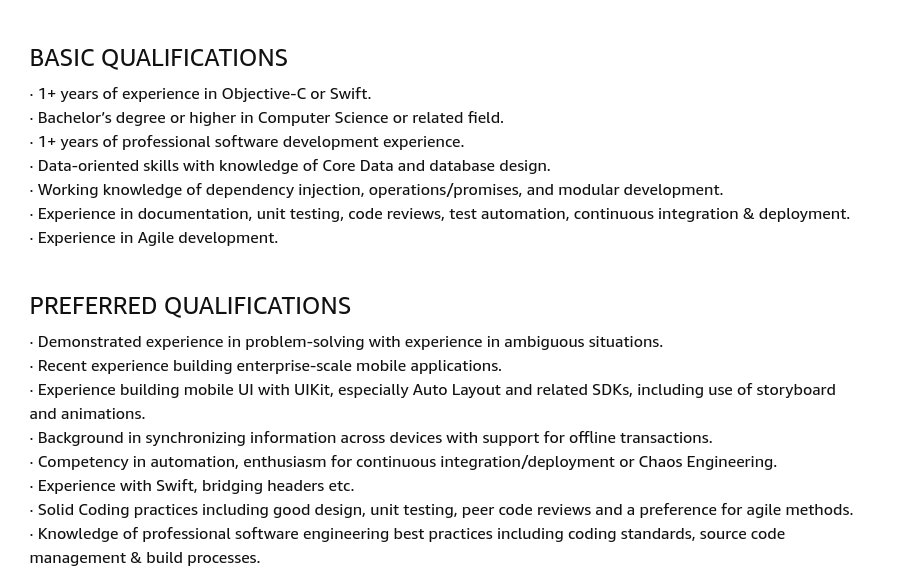

# Crackeando a entrevista de DevOps/SRE/Ops

Queria escrever esse texto a muito tempo, mas acabei adiando bastante. A ideia aqui é publicar um guia que ajude pessoas querendo entrar no mundo de infraestrutura indo mais pro lado de Cloud e DevOps/SRE, **mas estou focando nas entrevistas**. Eu sou mentor de algumas pessoas que precisam desse tipo de guia, então vou aproveitar para compartilhar aqui.

Quero deixar super claro repetidamente aqui nesse texto que o que vamos mostrar aqui são só exemplos para ter uma ideia do que esperar. E que existem inúmeras empresas que tem processo seletivo altamente zuado que não dá muito pra abranger aqui. Talvez eu faça um outro blog post sobre processos zuados e como se preparar pra eles caso vocês peçam. Sem dúvida, os processos de FAANMGs são zuados né, então já está parcialmente coberto. Mas vamos lá...

# Um pouco sobre a experiencia que tenho (temos) na area (Opcional - pode pular)

Fiz parte de vários processos seletivos tanto como pessoa entrevistada e como pessoa entrevistadora. Como é de praxe na nossa área técnica: Não existe bala de prata pra passar nessas entrevistas. Existe um certo padrão, e é o que vou explorar aqui, mas o processo em detalhe ainda depende muito da empresa pra qual você vai aplicar. Vou tentar trazer minha experiencia e a experiencia de inúmeros amigos que tenho trabalhando na area. Mas entenda que nossa experiencia é limitada ao que a gente teve acesso, e não necessariamente é aplicável a você. Ainda assim quero escrever aqui algo que seja útil para a maioria que vier ler.

Meu background é meio bagunçado. Eu comecei a vida acadêmica em engenharia eletrônica, mas depois de um intercambio, resolvi mudar pra engenharia de software. No mercado fui meio que de tudo, exceto front-end. De Backend a sysAdmin. De SRE a Ops puro. De mantenedor Open Source a Cloud Engineer. Os amigos que estou consultando para esse texto também tem um background parecido, mas claro que com suas especializações em areas de TI diferentes. A ideia é trazer perspectivas que não sejam só minhas.

# Um pequeno glossário (Opcional - pode pular)

Se você é iniciante, nesse ponto já deve ter se deparado com algumas siglas nesse texto que te fizeram abrir o google. Vou tentar fazer pequenas definições aqui, que sejam simples o suficiente, para que o texto se torne um pouco mais entendível. Usarei um pouco de licença poética aqui para não dar definições muito longas ou detalhadas. Mas darei links para quem quiser ir mais a fundo. Não leia essas definições agora. Volte nas definições quando a palavra for usada no texto em algum contexto e precisar saber do que se trata.

**DevOps:** É um movimento, ou conjunto de práticas para diminuir o clássico conflito entre desenvolvimento e operações (além de ter a intenção de aumentar velocidade, qualidade e observabilidade de entregas/sistema). Desenvolvimento sempre foi recompensado por novas features, mudanças e isso gera instabilidade. Operação sempre foi recompensado por manter servidores no ar, estabilidade, falta de mudança. DevOps veio pra mudar/Balancear isso. DevOps hoje em dia também pode ser o nome de um cargo. Isso já foi controverso, pois pode fugir a alguns preceitos, mas já aceitamos que vão continuar chamando cargos de DevOps e é a vida. Se quiser ler mais: [Definição de DevOps pela AWS](https://aws.amazon.com/devops/what-is-devops/#:~:text=DevOps%20is%20the%20combination%20of,development%20and%20infrastructure%20management%20processes.).

**Dev:** Times de desenvolvimento, Programadora(e)s, Engenheira(o)s de Software, pessoas envolvidas na construção do código do produto em si.

**Ops:** Operações, Administradora(e)s de redes, Administradora(e)s de sistemas, pessoas envolvidas em manter servidores e infraestrutura adjacente em pé.

**SRE:** É a sigla em ingles para Site Reliability Engineer. Ou a tradução oficial: Engenharia de Confiabilidade. O termo foi cunhado pela Google, e é a resposta que tiveram para o conflito citado na definição de DevOps acima. [Tem um vídeo da Google](https://www.youtube.com/watch?v=uTEL8Ff1Zvk&ab_channel=GoogleCloudTech) dizendo que SRE é a real implementação de DevOps. Ou seja, DevOps é o conceito, o movimento, e SRE é o cargo, a implementação. O ponto é que a Google escreveu um livro que define as práticas e o que eles de fato fazem internamente para aplicar Engenharia de Confiabilidade. Dentro desse livro abordam muita coisa que não convém citar aqui, mas destaques são: Error-budgets, Blameless/Just Culture, SL[I,O,A].

**SLA:** É a sigla em ingles para Service Level Agreement. Ou a tradução para o português: Acordo de Nível de Serviço. SLA é a promessa, normalmente feita com relação a disponibilidade, que um provedor faz a seus usuários ou clientes. Se você lança um serviço agora para um cliente, e promete SLA de 99.9%, quer dizer que você está com o serviço de pé o ano todo, mas pode cair por 8.77 horas no ano. Se seu SLA é de 99.99%, só pode cair por 52.60 minutos no ano. Cada nove depois da virgula dificulta cada vez mais manter essa promessa. Se quiser ler mais: [SRE fundamentals 2021: SLIs vs SLAs vs SLOs](https://cloud.google.com/blog/products/devops-sre/sre-fundamentals-sli-vs-slo-vs-sla)

**SLO:** É a sigla em ingles para Service Level Objective. Ou a tradução para o português: Objetivo de Nível de Serviço. SLO é similar ao SLA, mas o SLA é mais realista, o SLO é mais ambicioso. É o objetivo interno do seu time. Na verdade é o SLO que se escolhe junto com seu time de produto e infra e negócio. Quanto mais noves após a virgula, mais caro é manter disponibilidade. Definindo o SLO com cuidado, o próximo passo é definir o SLA, com uma margem de segurança. Se quiser ler mais: [SRE fundamentals 2021: SLIs vs SLAs vs SLOs](https://cloud.google.com/blog/products/devops-sre/sre-fundamentals-sli-vs-slo-vs-sla)

**SLI:** É a sigla em ingles para Service Level Indicator. Ou a tradução para o português: Indicador de Nível de Serviço. SLIs são o conjunto de métricas que se está medindo. Pode se medir frequência de erros, uptime, latência e outras métricas. Se quiser ler mais: [SRE fundamentals 2021: SLIs vs SLAs vs SLOs](https://cloud.google.com/blog/products/devops-sre/sre-fundamentals-sli-vs-slo-vs-sla)

**Error Budget:** É uma das práticas para tentar balancear o conflito entre Devs e Ops (e business). É definir um bom SLO, e definir uma quantidade saudável de erros e instabilidade no ano para usar tranquilamente para fazer mudanças e evoluções. Error Budget é 1-SLO, ou seja se seu SLO é 99.9%, 1-99.9% = 0.1% error budget. Se quiser ler mais: [Example Error Budget Policy](https://sre.google/workbook/error-budget-policy/)

**Blameless/Just Postmortem Culture:** É a prática de sempre documentar falhas e indisponibilidades, mas sem apontar culpados, sempre visando achar a causa raíz e apontar melhorias. Além de documentar é de praxe divulgar para que outras partes da organização, ou até outras organizações, aprendam com o mesmo acontecimento. A culpa de falhas é sempre do processo e da organização, pois sempre esperamos o melhor de cada pessoa do time. Seres humanos vão cometer erros, e ao perceber pontos do processo em que esses erros possam ser devastadores, automatize para evitar intervenção humana, ou melhore o processo de revisão do que quer que causou o erro (entre outras formas de **evitar** erros). Culpar e punir pessoas por falhas críticas só vai aumentar a vontade dessas pessoas de não reportar erros. Se quiser ler mais: [Postmortem Culture](https://sre.google/sre-book/postmortem-culture/)

**IC:** É a sigla em ingles para Individual Contributor. É basicamente dizer que sua posição não lidera ou gerencia nenhuma outra pessoa do time. Pode liderar tópicos, ou partes técnicas, mas não gerencia pessoas. Dependendo da empresa da pra crescer bastante e continuar sendo IC. 

**Culture Fit:** É o que empresas consideram quando avaliam se você está alinhado com a cultura interna deles. Você é um Fit (voce se adéqua) quando se comporta como eles esperam em determinadas situações.

**FAANMG:** Conjunto das empresas que pagam melhor no mercado de TI (consequentemente um tanto mais difíceis de entrar). Facebook, Amazon, Apple, Netflix, Microsoft e  Google. Essa sigla muda e de vez em quando inclui ou exclui algumas empresas. Mas no geral se pronuncia "[fang](https://www.macmillandictionary.com/dictionary/british/fang_1)".

**Big Tech Corps:** Seila. Botei esse termo aí pra facilitar. Pense em FAANMG + empresas adjacentes que são gigantes e ainda aplicam testes de estrutura de dados e algoritmos pra todas as vagas, mesmo não sendo vagas de programação.

**Brute Force:** Uma solução não otimizada que tenta varrer todas as possibilidades até achar a resposta desejada.

**System Design:** É o processo de definir arquitetura, design de produto, módulos, interfaces, comunicação entre componentes, tecnologias e onde dados vão ficar (e como vão ser consumidos) dentro de um sistema, para poder entregar algo que atenda aos requisitos.

**Cloud Native:** É um termo muito complicado e difícil de definir. Pode estar se referindo a processos, ferramentas, estratégias de business e outras coisas. Quando se fala em tecnologia, Cloud Native se trata de estar preparado para a escala e elasticidade da Cloud. Geralmente estamos falando de tecnologias relacionadas ao [Cloud Native Landscape](https://landscape.cncf.io/).

**Mock Interview:** Pedir pra alguém experiente fingir que é uma pessoa entrevistadora, e fazer uma entrevista de mentira, bem exigente e com verosimilhança.


# Pra quem é esse texto

Esse texto é pra todo mundo planejando fazer uma entrevista na área. Vou tentar ter seções para todos os níveis, tentando explicitar como pode ser a entrevista, e como se preparar (preparação vem depois no texto, tem muito blog sobre preparação, o foco aqui é um pouco mais sobre o processo). Vou dividir as seções nas seguintes partes:

- Para iniciantes e migrações de carreira
- Para quem ja teve alguma experiencia na área
- Para veteranos, mas ainda IC
<!-- - Veteranos migrando ou recentes em liderança
- Veteranos indo para cargos bem mais sênior (Staff, Principal, etc) -->

Dentro de cada um desses momentos de carreira, vou tentar explicitar alguns perfis de empresa (omitindo parte deles dependendo do perfil):

- Big Tech Corp
- Empresas em geral

E em cada um desses perfis de empresa, além de explicar o que ja vi (e o que meus amigos ja viram), vou dar algum exemplo de desafio próximo do que pode se esperar para ele. Vou obviamente não compartilhar nenhum desafio que esteja protegido por Non Disclosure Agreement. Mas usarei exemplos similares.

# Iniciantes

Estou considerando iniciantes pessoas com menos de 6 meses de experiência com infraestrutura.

Tendo 0 experiencia na área, nunca ter encostado em ferramentas do mundo DevOps e conseguir uma entrevista é um tanto raro. É possível, e existem algumas empresas que fazem programas de treinamento e inclusão para pessoas sem experiencia (inclusive para dar oportunidades para pessoas de grupos sub-representados). Normalmente até esses programas exigem alguma familiaridade com algo do mundo tech (um projetinho, ter feito algum curso, alguma coisa). De qualquer maneira se você tem 0, ou pouca experiencia, vamos às opções que temos disponíveis.

## Iniciantes (menos de 6 meses) - Em Big Tech Corps
*Pule essa seção se não tem interesse em FAANMG e similares*

**O que esperam:** Conhecimento básico de programação, suficiente para resolver desafios de nível fácil. Conhecimento beeem básico de linux ou alguns projetinhos pessoais tendo brincado com CI/CD e afins. Que consiga se virar e explicar suas soluções pra pessoa entrevistando.

Espere pelo menos uma entrevista comportamental e algum desafio/questionário técnico em tempo real (podem ter outras fases, mas essas duas são sempre inclusas). 

### Parte comportamental

Essas empresas suficientemente grandes tem princípios de sua cultura bem estabelecidos e divulgados, e por conta disso se preparar para a entrevista comportamental é razoavelmente simples. O que querem testar é se você é um Culture Fit. Para Amazon testam se você demonstra alguns dos [16 Leadership Principles](https://www.amazon.jobs/de/principles), para Google testam se você é [Googley](https://www.thinkwithgoogle.com/future-of-marketing/emerging-technology/missions-that-matter/) o suficiente. Só dei esses dois exemplos por serem bem evidentes, entretanto, não estou dizendo para considerar somente FAANMGs (inclusive, para iniciantes, provavelmente melhor não considerar FAANMG de jeito nenhum, se não for algo muito importante para você). Considerando outras empresas grandes é também possível achar indícios de como sua cultura é internamente, principalmente em blogs, e possivelmente páginas do site da empresa. 

Exemplos de perguntas que podem rolar aqui: `Me dê um exemplo de uma situação em que você não alcançou a expectativa de um cliente ou de alguém. Como você lidou e o que teve que fazer para contornar a situação?`. 

Talvez sua resposta já esteja na ponta da lingua, mas saber da cultura da empresa te ajuda a preparar algo que alinhe com o que a empresa quer escutar. Olhar o Glassdoor da empresa ajuda bastante também, pois pessoas cadastram perguntas que são frequentes da empresa lá.

### Parte técnica

Para o desafio técnico, se a empresa for suficientemente grande, espere com certeza que o teste vá ser ao vivo. Se não for ao vivo, com certeza vai ser algo com correção automática (e provavelmente pode ser as duas coisas). O motivo disso é que essas empresas irão procurar economizar ao máximo para não ter um engenheiro que poderia estar fazendo software gastando muito tempo corrigindo depois o que você fez. Então nada de desafio para "levar para casa" aqui, pois dá trabalho pra corrigir. Algo que é comum é pedir para o candidato resolver um problema simples (auto-corrigível) no Hackerrank (ou similar), e em seguida fazer uma entrevista técnica onde um engenheiro te pergunta algumas coisas por algum tempo.

Partindo do exemplo acima, para uma pessoa ingressando na area, espere algum problema simples de programação ou algumas perguntas simples de infra. 

Um exemplo de problema simples bem fácil de programação para essas empresas grandes pode ser esse aqui:

```
    Dadas duas strings binárias a e b, retorne a soma delas como uma string binária. 
    [Exemplo. Input: a = "11", b = "1"; Output: "100"`
```

Eu sei que a vaga é pra algo de infra, e programação não necessariamente está envolvido, mas essas empresas costumam testar assim de qualquer maneira, inclusive para iniciantes. Primeiro motivo é o que eu disse, fácil auto-correção, segundo é que algumas dessas empresas são opinionadas em querer que todos funcionários com algum conhecimento de programação. Se sua intenção é, pelo menos no início, não focar em programação, não aplique pra essas empresas (por mais que eu recomende sim aprender programação para todo mundo 😂).

Um exemplo de pergunta muito simples de infra pode ser:

```
    O que os campos da saída de `ls -al` significam? 
    '-rwxrw-r--    1    root   root 2048    Jan 13 07:11 db.dump'
```

E nesse caso teria que explicar as permissões, número de links, nome do dono e assim por diante.

Esses dois são exemplos para saber o que poderia esperar nesse nível, e é claro que a empresa perguntaria mais perguntas e possivelmente mandaria um desafio online com várias partes.

Na maioria dessas entrevistas não é esperado que venha com a resposta de cara. A pessoa entrevistando vai procurar ver seu raciocínio, te perguntar o que você está pensando, e tentar te guiar sem te dar a resposta (depende da empresa, claro).


## Iniciantes (menos de 6 meses) - Empresas em geral

**O que esperam:** Depende muito da vaga, mas de maneira geral esperam que consiga se virar. Empresa que não é FAANMG e cobra muito conhecimento de iniciante tá é querendo achar trabalho especializado barato e isso não é ok.

Não ache que FAANMGs, ou empresas gigantes, são o objetivo máximo de todo mundo em tech. Tem gente que prefere trabalhar para startups começando, tem gente que prefere trabalhar em empresas menores onde se conhece todo mundo, ou até gente que prefere trabalhar para empresas de outros ramos começando em tech, pelo desafio da transformação. Estou incluindo aqui empresas de pequeno, médio porte. Também estou incluindo algumas empresas de grande porte, mas que seu business não é necessariamente tech puro.

Nesse cenário, entrevistas e processo seletivo variam bastante. É um mar de opções que vai de totalmente informal a totalmente estruturado. Vou tentar mostrar algumas opções.

<a name="alguma-xp-empresas-geral-comportamental"></a>
### Parte comportamental

Para a parte comportamental ainda vale a pena olhar site da empresa. Entender sua cultura e o que é importante para a organização. Mas de maneira geral, em entrevistas menos estruturadas, o que vai importar é fazer a pessoa entrevistadora ir com sua cara. Muitas vezes a pessoa entrevistando vai ser quem vai te gerenciar ou você vai ser integrada(o) no time dela. Uma das coisas que a pessoa está verificando é se quer trabalhar contigo no dia a dia. Para entrevistas mais estruturadas vão tentar tirar viés e alinhar perguntas e respostas aos valores que estão procurando, mas ainda é raro empresas que conseguem fazer isso efetivamente, então conectar (pessoalmente) com a pessoa entrevistando é importante ainda.

### Parte técnica

Considerando desafios técnicos, para iniciantes completos (menos de 6 meses de xp), muitas vezes não é necessário nem passar por um desafio propriamente dito. As vezes só testam fluência computacional, como nomear componentes e saber por alto como um computador funciona. É comum testarem resolução de problemas técnicos de uma forma mais próxima da entrevista comportamental. Então um exemplo seria:

```
    Qual foi o ultimo problema técnico que você teve que resolver, e qual foi sua estratégia para chegar numa solução?
```

Dessa forma te dando oportunidade para falar de algo técnico de sua escolha. De preferencia escolha algo mais próximo do que você faria na posição pra qual está aplicando. Mas a questão é aberta justamente pra te dar abertura pra trazer outras coisas.

É raro mais é possível ter desafio "para levar pra casa". Por ser raro para iniciantes completos, prefiro explicar em outra seção.

É também comum uma entrevista técnica em que a pessoa entrevistando te dá um desafio de algo de infra, mesmo que você não saiba nada sobre aquilo, para ver como você se vira junto com ela. Assim como descrevemos antes, a pessoa vai te guiando para ver se pelo menos você consegue fazer perguntas que te sejam úteis. Pois sendo iniciante num emprego é exatamente isso que você vai ter que saber fazer: Boas perguntas.

Por fim, existe as entrevistas com 23489234789 fases e com requisitos exorbitantes para iniciantes. É horrível que isso exista. Como disse no início dessa seção, fazem isso pra pagar menos para uma pessoa iniciante mas super performante, ou alguma pessoa com baixa confiança e auto estima que aceita estar em um nível de senioridade inferior. Também existe empresas que copiam o processo seletivo de FAANMGs, colocando desafios que testam conhecimento de estruturas de dados e algoritmos, e resolução de problemas complexos. Vou falar disso em outra seção.


# Alguma Experiencia na Área

Vou evitar de propósito os níveis de senioridade clássicos da indústria nesse texto, mas se fosse pra inserir aqui, insira Júnior. Uma pessoa que tem alguns projetos pessoais, ja teve exposição à algumas tecnologias, fez um curso um pouco mais longo com mão na massa, talvez instalou o linux e está tentando usar no dia a dia ou talvez fez algum estágio por algum período de tempo.

## Alguma Experiencia na Área - Em Big Tech Corps
*Pule essa seção se não tem interesse em FAANMG e similares*

**O que esperam:** Para Big Tech Corps a expectativa de conhecimento vai ser bem parecida a dos iniciantes, só incrementando a profundidade e dificuldade. Então conhecimentos de estruturas de dados e algoritmos, suficiente para resolver desafios de nível fácil e talvez médio. Conhecimento razoável de redes e sistemas operacionais em geral. Ter trabalhado em projetos com CI/CD. Esperam que consiga se virar e explicar suas soluções pra pessoa entrevistando.

Se você procurar agora por vagas Junior nessas empregas um pouco mais gigantes vai perceber duas coisas. A primeira é que vagas Júnior de Ops são um pouco difíceis de encontrar, mais difícil ainda em FAANMGs e similares. E quando encontramos alguma vaga Junior, pede mais de um ano de experiencia. Exemplo de uma [vaga iOS](https://www.amazon.jobs/de/jobs/1528493/junior-ios-engineer), pois não achei de infra enquanto estava escrevendo esse texto (mas consegui informações de conhecidos com experiencia em vagas Júnior nessas empresas).




### Parte comportamental

Considerando as entrevistas de cunho comportamental, o que vai mudar, pra parte de iniciantes, é que eles vão observar se você consegue mostrar mais "evidencias" de que age de acordo com os valores da empresa. Também vão ver se mostra esses valores em situações que tenham um pouco mais de impacto. Isso vai crescendo cada vez mais de acordo com a senioridade. Se te perguntarem "Como foi a ultima vez que você teve que lidar com conflito entre colegas de trabalho" para uma vaga de treinamento para iniciantes talvez venham procurar evidencias de que você tentou desescalar a situação, mas numa vaga Júnior talvez tentem ver se vc também agiu de alguma maneira que achasse a causa real do conflito para resolver. Assim como na seção anterior, ler e internalizar o que a empresa divulga sobre sua cultura interna é importante. E pode parecer artificial, mas faz toda diferença ensaiar possíveis respostas para essas perguntas (principalmente se a entrevista não for na sua lingua materna). Leia sobre os guias culturais da empresa, procure exemplos de perguntas no Glassdoor e outras plataformas, e ensaie possíveis respostas. Mesmo que perguntem outras coisas, vai conseguir se virar muito melhor assim por estar na mesma vibe.

### Parte técnica

Para o desafio técnico seria muito semelhante, mas aumentando dificuldade. Não espere algo como um desafio para levar para casa e passar dias fazendo. Não espere nada que vá dar muito trabalho pra pessoa entrevistadora corrigir. Coisas que aparecem aqui são desafios auto-corrigíveis, ou entrevistas com desafio técnico ao vivo (ou ambos).

Um  exemplo de desafio de programação um pouco mais difícil (do que o da seção anterior) que pode cair, talvez numa plataforma como Hackerrank ou similar, pra fazer em casa, mas auto-corrigível:

```
    Dado uma string s, retorne a maior string palindrômica em s
```

No enunciado provavelmente explicariam o que é uma string palindrômica (é igual de traz pra frente, como ana), e com certeza mostrariam exemplos de entrada e saída. A solução não otimizada disso varre todas as possibilidades (Brute Force), e para um Júnior é possível que seja suficiente. Para uma vaga plena talvez a expectativa fosse que que pelo menos conseguisse pensar em começar a montar a solução otimizada, que usa programação dinâmica (que não vem ao caso explicar aqui).

Para uma entrevista técnica ao vivo de uma vaga Júnior de infra numa empresa Big Tech Corp, espere algumas coisas um pouco mais específicas. Exemplos (totalmente ilustrativos):

```
    O que é ssh, e como funciona?
    Explique 3 DNS records diferentes e para que são usados?
    O que é um CIDR em redes, e no que difere de um ip?
    Explique nas suas palavras, o que acontece quando você acessa um site no seu browser por baixo dos panos?
    Que fases você colocaria numa pipeline de integração contínua?
    Em redes, que portas bem conhecidas você lembra de cabeça? (essa é meio bullshit, mas botei alguma bullshit de propósito pois é importante se preparar pra pergunta decoreba também, infelizmente)
```

Perceba que algumas perguntas são abertas para que você entre em quanto detalhe você quiser, algumas são bastante específicas e esperam uma resposta pontual. O mundo hoje gira em torno da web, então várias coisas acabam encostando em redes, mas é claro que isso depende da vaga. Os exemplos a cima são mais para ter noção do nível de dificuldade. Nesse tipo de entrevista técnica com a pessoa de perguntando, é normal a pessoa ir te espremendo o máximo que conseguir. Então é mais do que natural não saber várias coisas quando aperta, pois é só sinal da pessoa entrevistadora achando o seu limite de conhecimento, pra saber te posicionar. Idealmente a pessoa entrevistadora dá uns passos para trás quando isso acontece, e muda de assunto/área.

### Parte System Design

Existe um tipo de entrevista que se chama System Desing, que várias empresas incluem no processo seletivo. As vezes excluem ela de entrevistas entry level, mas para vagas relacionadas a infra é comum manter (daí perguntam pensando em sistemas mais simples). Uma pergunta pra uma vaga plena seria algo na linha de: "Como você faria o System Design completo de um clone do Twitter, suportando a mesma escala?", e isso é bem complicado. Mas para um Júnior é possível que perguntem algo no nível de: "Como você faria o System Design de um aplicativo simples de lista de afazeres (pensando em componentes de infra, backend, banco de dados, e tecnologias)?". Assim como todas as outras coisas que falamos, não é esperado que consiga falar tudo com os melhores detalhes ou que dê a melhor resposta, geralmente o que é mais importante é saber perguntar e bolar uma solução que faça algum sentido, se comunicando bem.


## Alguma Experiencia na Área - Empresas em geral

**O que esperam:** Aqui já vão esperar mais conhecimentos em linux, algumas ferramentas do mundo DevOps, e ter atuado em projetos reais (ou projetos pessoais com cara de produção). Muito provavelmente **não** vão esperar muita proficiência com programação (Claro, existem exceções).

### Parte comportamental

Para a parte comportamental, para empresas em geral, vai ser muito semelhante ao que descrevi na seção de iniciantes. Se a entrevista não for estruturada, tente ser profissional e uma pessoa que passe a ideia de que é bacana trabalhar contigo. Procure sobre a empresa em seus site e blogs e tente ser o que a empresa tá procurando. Se a entrevista for estruturada, vai ser semelhante às entrevistas das FAANMGs, e aí tente expor "evidencias" de que voce pratica os valores da empresa, de acordo com as perguntas que vierem.

### Parte técnica

Para a parte técnica, aqui começa a ficar um pouco mais interessante. Na seção anterior eu não quis falar de desafios de "levar pra casa". Aqui nessa seção, com alguma experiência, e em empresas em geral, já é mais comum ver isso acontecendo. Um exemplo de desafio que é possível ver aqui:

```
    Te demos acesso a um repositório em nossa organização, lá tem uma aplicação escrita em javascript. Tem uma pipeline (CI) falhando no seguinte link [url da pipeline]. Você tem uma semana para arrumar essa pipeline e fazer melhorias que conseguir. As pipelines são configuradas no arquivo .gitlab-ci.yml desse repositório. A documentação fica aqui [url da documentação].
```

Perceba que esse é um desafio que daria pra passar tanto pra Juniors e para Plenos. Talvez deixando claro para Juniors que não é necessariamente esperado que eles resolvam o problema. Mas ao final da semana a pessoa entrevistadora pareia com você e você tem a oportunidade de mostrar tudo que tentou, o que não conseguiu, e o que conseguiu. Você tem a oportunidade de mostrar as partes da pipeline que entendeu, e as partes que não entendeu. E daí vai ser avaliado em cima disso (Pedi autorização, esse é um desafio de uma empresa pequena do aí do Brasil, e eu acho maneiro).

É claro que ainda temos entrevistas técnicas de perguntas e respostas para vagas de infra dessa seção também. Para pouca experiência na area, não costumam pegar muito pesado, então coisas que perguntam são mais em cima da sua experiência. Se você disser que mexeu bastante com Cloud, é possível que perguntem "Que serviço da AWS você usaria para guardar diversos arquivos de imagens?" e a resposta seria S3. Se você disser que fez alguns projetos pessoais com CI/CD no github actions, devem te perguntar como você configurou, quais actions usou, como controlou credenciais e tudo mais. Pra uma vaga Junior é bacana casar a pouca experiencia que você tem com a necessidade e o que a empresa está fazendo. Mas talvez mais importante que isso é mostrar a capacidade de aprender rápido o que quer que a empresa esteja usando, mostrando que o que você aprendeu até esse ponto foi assimilado com sucesso.

É possível que façam perguntas não relacionadas a sua experiencia para as coisas que a empresa precisa de fato que a pessoa já saiba para a vaga. Mas sendo uma vaga Junior, ainda é possível que relevem você não saber, se mostrar outras qualidades.

# Veteranos, mas ainda IC

Aqui estou falando de pessoas com experiencia real de produção. Aqui dá pra entrar plenos, seniors, e até outros níveis, dependendo da progressão de promoções da sua empresa.

## Veteranos, mas ainda IC - Em Big Tech Corps
*Pule essa seção se não tem interesse em FAANMG e similares*

**O que esperam:** Conseguir se virar em linux, redes e sistemas operacionais em geral. Experiencia ou ter participado de times que tenham resolução de problemas reais de sistemas operando a todo vapor. Conhecimentos de estruturas de dados e algoritmos suficiente para resolver desafios de nível fácil, médios e talvez difíceis. Experiencia com tecnologias e topologias do mundo Cloud Native/DevOps. Experiencia em arquitetura de sistemas. Pode variar bastante na real.

### Parte comportamental

Para plenos e seniors aplicando para Big Tech Corps, a parte das entrevistas comportamentais vai esperar que basicamente todas as respostas mostrem algum aspecto dos valores da empresa exposto explicitamente (lembre-se, pesquise a empresa), e muitas vezes vai esperar que respostas mostrem mais do que um desses valores. Se está numa entrevista para Amazon (só um exemplo), e é uma pergunta sobre como lidou com treta de cliente, a expectativa é mostrar evidentemente pontos de [Customer Obsession](https://www.amazon.jobs/de/principles) ou talvez [Think Big](https://www.amazon.jobs/de/principles) juntos na mesma resposta. Querem ver onde você foi extremamente eficiente, onde parou pra planejar e onde avançou para correr um risco calculado. É difícil fingir tudo isso, é possível, mas é facilmente verificável. Pense em situações que você realmente demonstrou esses valores e saiba engrandecer a história. Contar histórias é a habilidade mais subestimada da nossa indústria.

Não se esqueça de ter na ponta da língua respostas para perguntas na área de metodologias, processo e de como fazer times serem efetivos. É esperado de pessoas com mais experiência que saibam um tanto sobre o que funciona e o que não funciona para operar times eficientes. DevOps é sobre compartilhamento, observabilidade, LEAN, automação e cultura. Cultura e LEAN são botados de lado de vez em quando. Lembre disso também.

### Parte técnica

Para parte técnica é quase certeza de que vão mandar alguma questão de programação para resolver, que pode ir de fácil a difícil. Eu ja mostrei algumas questões um pouco mais fáceis e próximas de médias anteriormente, vou mostrar uma difícil só para nivelar (é raro cair uma realmente difícil assim):

Nesse vou colar um link do Leetcode aqui, é possível ver a solução lá também, e discussões :) [Minimum Window Substring](https://leetcode.com/problems/minimum-window-substring/).

Para vagas de infra não necessariamente vão esperar a resposta otimizada, mas quanto mais indícios de que você tentou mais de uma solução, melhor. Encher de comentários, enviar a solução que conseguiu fazer passar, e explicar qual seria seu raciocínio pra caso tivesse mais tempo. Como disse antes, é raro cair questões difíceis dessas, mas é comum usarem desafios de programação para vagas de infra, em todos os níveis, em Em Big Tech Corps.

Na entrevista técnica vão testar seus conhecimentos de Redes, Cloud, linux, ferramentas e práticas DevOps/SRE em geral. É comum ter uma call com um engenheiro onde ele vai conversando contigo e te perguntando várias coisas e pedindo para você elaborar em cima do assunto. Exemplo:

```
    Como você resolveria um problema em que um dos microserviços do seu time não está conseguindo acessar seu respectivo banco de dados?
    Como você faria o debug desse problema?
    Se achasse uma solução, como evitaria que isso acontecesse de novo?
    Se o problema fosse DNS, o que você faria?
```

Mas é claro que na entrevista isso poderia ser mais orgânico, se o modelo de entrevista da empresa der liberdade para a pessoa entrevistando seguir do jeito que ela quiser. O ponto é que a pessoa entrevistando te daria um problema, e o que ela quer ver é como você triangularia uma solução.

Outras perguntas um pouco mais difíceis que é possível ver nesse nível em Big Tech Corps:

```
    Explique interrupções e Interrupt Handlers no Linux
    Você precisa deletar um diretório com milhões de arquivos. Como fazer isso eficientemente?
    Qual sua preferencia de estratégia de deploy? Push ou Pull Strategy?
    A latência de um dos serviços está muito alta, qual seria sua primeira suposição da causa, e como resolveria?
    Como otimizar debugging de pipelines do Jenkins (ou qualquer ferramenta de Ci semelhante)?
    Como definir um SLO que faça sentido?
    Pergunta específicas de alguma tecnologia também são possíveis, como: Como você permitiria SREs a fazer tasks de admin no seu cluster kubernetes, mas bloquearia Devs, deixando-os só dar get em recursos em namespaces específicas?
```

### Parte System Design

Aqui é clássico perguntarem algo do tipo: `Como você faria o design de sistema de um clone do instagram, começando simples e depois chegando a conseguir aguentar a mesma escala do instagram real?` (vou dar referencias pra como se preparar pra esse tipo de coisa no final). Se for remoto devem te dar acesso a algum mural do [Miro](miro.com) ou do [draw.io](draw.io) (ou similares) e te pedir pra ir desenhando um diagrama e explicando suas escolhas (claro, te fazendo perguntas e vão te guiando ao mesmo tempo). É normal usarem essa fase pra perguntarem algumas coisas genéricas de SysDesign antes de fazer a grande pergunta de como fazer um sistema inteiro. Algo como `Como decidir entre bancos de dados NoSQL ou SQL para um novo projeto?`. É esperado que você faça mais perguntas de volta, para ter mais contexto.

## Veteranos, mas ainda IC - Empresas em geral

**O que esperam:** Conseguir se virar em linux, redes e sistemas operacionais em geral. Experiencia ou ter participado de times que tenham resolução de problemas reais de sistemas operando a todo vapor. Experiencia com tecnologias e topologias do mundo Cloud Native/DevOps. Experiencia em arquitetura de sistemas. Pode variar bastante na real. De maneira geral, não é necessário saber grandes coisas de desenvolvimento de software, mas pode ser que acabe sendo requisito de algumas vagas.

### Parte comportamental
Além de mostrar valores da empresa, vão procurar respostas que refletem um pouco de senioridade, dependendo da vaga pra qual você aplicou. Mostrar senioridade não é tentar mostrar que sabe tudo, é mostrar como extrair mais de um time, como avançar problemas complicados pensando no cliente, ou como buscar conhecimento de maneira eficiente para determinado projeto novo. Tudo o que foi dito sobre a parte comportamental da [seção anterior de empresas em geral](#alguma-xp-empresas-geral-comportamental) também é válido aqui.

Para pessoas mais experientes, e pensando em DevOps, pense também em como responder perguntas de processo, metodologias, e como você agiria para fazer times de desenvolvimento serem mais eficientes junto com times de plataforma ou SRE. Como entregar mais rápido? Como aumentar a qualidade da entrega? Como lidar com demanda mas ainda ter preocupação com segurança?


### Parte técnica

Para veteranos, em empresas em geral, podemos ver de tudo aqui na parte técnica. É muito variado, mas vamos tentar abordar algumas possibilidades:

Vamos de novo ao desafio de levar para casa. O desafio que citei anteriormente sobre consertar uma pipeline pode caber perfeitamente aqui ainda, mas vamos explorar alguns outros exemplos. Um que ja vi com frequência, e é similar ao da empresa onde trabalho atualmente, é o de entregarem um repositório com alguma aplicação, e te pedir pra preparar tudo com relação a infra + CI/CD + integrações para o projeto do desafio. Algo como:

```
    Iremos te dar acesso à um repositório que possui uma aplicação em python (pode ser qualquer linguagem aqui na verdade). Siga o REadme para instruções de como levantar a aplicação e verificar se está funcionando. Seu desafio vai ser o seguinte:
    - Dockerize a aplicação e use boas práticas para container hardening nesse Dockerfile
    - Prepare um docker-compose.yml que levante o ambiente de desenvolvimento local
    - Crie uma nova pasta chamada terraform (se quiser pode usar Cloudformation ou qualquer alternativa que tiver experiencia) e escreva IaC que levante um managed cluster kubernetes para fazer o deploy dessa aplicação
    - Prepare as pipelines de deploy tanto da infraestrutura quanto deploy da aplicação nessa infraestrutura
    - Você tem X dias para terminar esse desafio. Sinta-se a vontade para tirar quaisquer dúvidas a respeito do desafio.
```

Esse é um tipo de desafio que toma bastante tempo tanto do candidato quanto da pessoa entrevistadora, pois corrigir isso não é uma tarefa rápida. Dependendo do tempo que leva pra fazer esse tipo de desafio, tem até empresas que pagam o seu tempo fazendo o desafio, mesmo que você não seja selecionado, para respeitar o seu tempo investido nisso. Sinta-se ainda mais a vontade de cobrar se o desafio for um dito "problema real da empresa", e que você está resolvendo no processo seletivo. Se é um problema real, de trabalho, todos concordamos aqui que deve ser pago, né 😂?!

É possível também utilizarem os ambientes de desafios de infra do Rackerrank (ou similar) em que te dão acesso ssh temporário a uma máquina e você tem que performar algumas tarefas descritas no enunciado nessa máquina. No fim o Rackerrank vai executar um script nessa máquina para verificar se a tarefa foi feita. Exemplo:

```
    Clique no botão avançar para ter acesso ssh à máquina desse desafio. Quando tiver acesso a máquina, performe as seguintes tarefas:
    - No diretório /home/SEUUSUARIO/app/ você vai encontrar um programa com nome app.py. Esse programa iniciar um servidor web que retorna o status code 200 e uma mensagem em plain text para requisições GET no path /. Verifique que isso é verdade.
    - Crie um Systemd Unit File que faça esse serviço (/home/SEUUSUARIO/app/app.py) esteja rodando nessa máquina sempre, mesmo que a máquina se reiniciar
    - Instale nginx nessa máquina e configure para que o nginx sirva esse serviço na porta 80 externamente
    - Temos um domínio temporário (só durante esse teste) apontando para o IP dessa máquina. Temos certificados válidos no diretório /etc/letsencrypt/live/DOMINIOTEMPORARIO/. Configure o nginx para que sirva esse site com https na porta 443 (faça requisições na porta 80 se redirecionem para porta 443).
    - Crie um Cronjob que periodicamente (toda segunda feira) apague o diretório /tmp/dados
    - Crie um usuário nessa máquina com nome 'finance', sem acesso ao shell/bash, mas que possa rodar comandos indiretamente
    - Faça que o usuário com a seguinte chave pública [CHAVEPUBLICA consiga acessar essa máquina por ssh quando precisar, no usuário user123
```

A empresa vai configurar o Rackerrank (ou similar) para te deixar ter acesso à maquina por algum período de tempo, e você tem esse tempo pra executar as tarefas. De vez em quando é tempo mais do que suficiente. Mas as vezes a empresa dá pouco tempo de propósito pra ver como quanto você consegue fazer, e como você gerencia seu tempo.

Exite também a possibilidade de a empresa marcar uma entrevista em que você vai resolver um problema JUNTO COM a pessoa entrevistadora. Vocês vão parear num problema razoavelmente real, e o que querem testar é se você consegue colaborar para solução de problemas, e se você consegue se comunicar efetivamente para alcançar um objetivo. É similar a uma entrevista comum, mas a diferença é que a pessoa entrevistadora vai ativamente estar querendo solucionar o problema também, tentando te ajudar em partes.

Claro, ainda existe a entrevista clássica em que te perguntam coisas a respeito de redes, linux, infra, Cloud e tudo mais. Assim como nas descrições que fiz anteriormente, a ideia é sempre mostrar seu raciocínio, fazer mais perguntas pra entender o contexto, e chegar numa resposta mais detalhada que for possível.

Mais alguns exemplos clássicos:

```
    - Como funciona resolução DNS, explique com a maior quantidade de detalhes que conseguir?
    - Como se resolve problemas de CORS?
    - Como cookies passam no protocolo HTTP?
    - Como medir latência e outras métricas de um serviço só com ferramentas linux numa máquina?
    - Como matar um processo que está bloqueando um arquivo?
    - Que mudanças você faria inicialmente em pipelines de CI que estão muito demoradas?
    - Um banco de dados gerenciado na cloud está em 100% de CPU, e sua réplica está com replication lag enorme, quais são seus primeiros passos para investigar?
    - Que serviços da AWS (ou sua cloud favorita) você mais passou raiva, e como geralmente resolve problemas nele?
```

# Ok Lucas, mas como eu me preparo para algum desses níveis de entrevista?

## Iniciantes

Se for iniciante, só se preocupe com o que quer que eu tenha falado aqui se for ter alguma entrevista marcada. O ideal de verdade para iniciantes é focar em fundamentos e ir tentando se embasar melhor. Como podem notar, alguns dos desafios te testam para o que fazer de verdade no emprego, mas alguns não fazem isso. Se prepare para ter bons conhecimentos de Linux, redes, sistemas operacionais, Cloud e ferramentas Cloud Native. Um de cada vez, com calma. Se tiver acesso a alguma mentoria, cola nessa pessoa mentora para conseguir ter um cronograma, e um plano do que fazer a cada etapa.

Mas caso a entrevista esteja batendo na porta, se prepare para a entrevista pesquisando a empresa, e focando no que a empresa usa. Revise comandos, revise conceitos, e saiba falar sobre o que você ja fez. Tenha principalmente o que você já fez muito bem preparado e treinado. refaça tudo.

## Pessoas com alguma experiencia e veteranos

Como plano maior geral, esse roadmap aqui é bem bom para ter como objetivo na vida: https://roadmap.sh/devops

A galera que mantém esses roadmaps atualizam eles com alguma frequência, e a ideia é ser completo, mas marcando coisas que são opcionais.

Com relação a se preparar aqui vão alguns materiais:

- Esse site te manda desafios de infra todo dia. Desafios reais te dando acesso à maquinas: https://kodekloud-engineer.com/
- Procure por DevOps Interviews, ou Ops interview, ou SRE interviews no google. Eu sei, é óbvio, mas convém falar.
- Olhe o Glassdoor da empresa que você está mirando, ou a empresa com a qual você já tem uma entrevista marcada. Tem tanto perguntas técnicas quanto perguntas comportamentais no Glassdoor.
- Procure por esses compilados de preparação no github como (tente entender as perguntas, responder sem ajuda, e rodar o que for necessário pra exemplificar cada coisa):
    - https://github.com/michael-kehoe/sre-interview
    - https://github.com/trimstray/test-your-sysadmin-skills
    - https://syedali.net/engineer-interview-questions/
- Pegue créditos grátis em clouds e use de playground para tudo:
    - http://cloud.google.com/free
    - https://aws.amazon.com/free
    - https://azure.microsoft.com/en-us/free
- Se tiver com grana, pague algum curso de certificação, mesmo que não for tirar a certificação (aproveite e tire):
    - https://www.udemy.com/course/certified-kubernetes-administrator-with-practice-tests/
    - https://www.coursera.org/professional-certificates/gcp-cloud-architect
    - https://acloudguru.com/aws-cloud-training
    - Dá uma olhada na galera brasileira que tem um conteúdo foda também: https://www.linuxtips.io/pages/trilha-de-treinamentos
    - Existe um monte de conteúdo foda no youtube também, de graça
- Se for aplicar pra empresas que exigem conhecimento de estruturas de dados e algoritmos para desafios de programação:
    - Leetcode é basicamente a plataforma que todo mundo usa pra se preparar https://leetcode.com/
    - https://leetcode.com/interview


**Como se preparar para entrevista com uma pessoa olhando pra sua cara e te botando pressão?**

Faça Mock Interviews. Bastante. É provavelmente a melhor dica. Ensaie bastante. Escreva o que vai falar num papel, mas escreva do jeito que você fala, ache sua voz. Por exemplo:

```
    Quando resolvi esse problema, eu fiz isso e aquilo. Mas, tipo, sabe aquilo outro? Pois é, aquilo foi assim e assim. hmmm Me deixa pensar... É também teve aquela coisa que fiz assim e assim e tals (blablabla)
```

Na frase acima, eu escrevi `Mas, tipo, sabe aquilo outro?`. Escrevendo a gente não coloca essas construções informais (`tipo`) normalmente. Mude isso agora, escreva exatamente o fluxo que você usa pra falar, quando for escrever o seu "roteiro de entrevista". Isso vai te ajudar imensamente. Você vai conseguir inclusive mudar ele e fazer ficar mais orgânico na hora da entrevista, mas escrever isso no papel vai te ajudar a ter opções e vai te exercitar antes de falar.

Tente ensaiar e escrever seu roteiro pra maior parte de perguntas possíveis. Pode ser exagero dependendo da situação, mas com certeza pode valer a pena caso seja um emprego que possa mudar sua vida. Tenha uma estratégia, e saiba ler as expressões da pessoa entrevistando. Saiba que peguntas são pra preparar o solo para perguntas mais difíceis que venham depois.

Mandar bem em entrevista é algo treinável. E a parte mais importante é saber passar informação, mais especificamente a informação que for útil pra pessoa entrevistadora. Ache e pergunte pra esclarecer se não tiver certeza. É melhor do que dar uma resposta que não tem nada a ver com o que a pessoa quer.


## A entrevista que vou fazer não parece com nada que vi nesse texto, Lucas

Me mande uma mensagem no twitter @canelasevero, ou me ache nas minhas outras redes aqui no meu site (knela.dev). Quero fazer mais alguns textos nesse sentido. Talvez até entrando em mais detalhes em cada tipo desses que citei.

Esse texto está no github no meu repositório, e eu aceito Pull Requests. A ideia é ser a principal parada pra pessoas que não tem ideia do que esperar. Lendo isso aqui essas pessoas podem pelo menos não se sentir perdidas. 

Sintam-se a vontade para entrar em contato se tiver alguma entrevista marcada e não souber o que fazer. Posso também redirecionar para amigos que manjam de algumas empresas ou algumas áreas específicas.

Tem duas seções que omiti por ter poucos dados, mas que talvez seja interessante adicionar:

- Veteranos migrando ou recentes em liderança
- Veteranos indo para cargos bem mais sênior (Staff, Principal, etc)

Me deem feedback e me aponte pra pessoas que possam ajudar com esse conteúdo.
